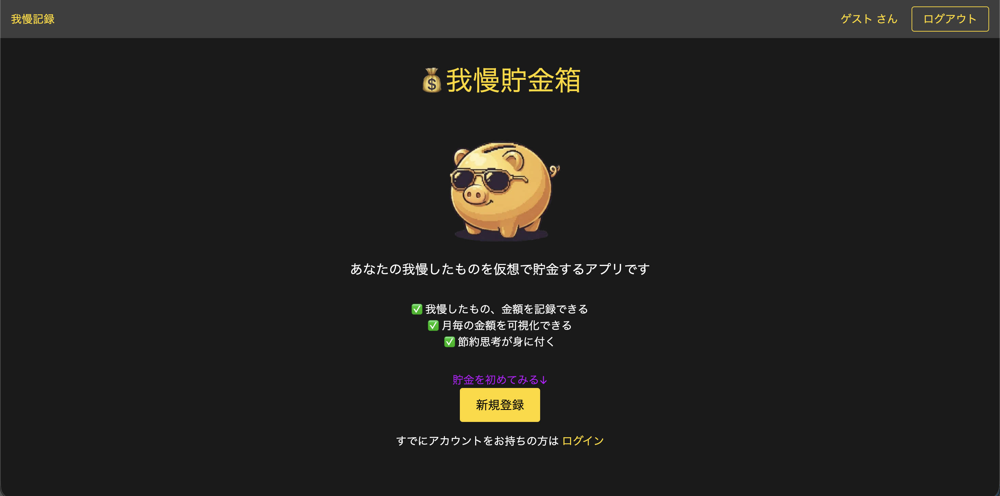
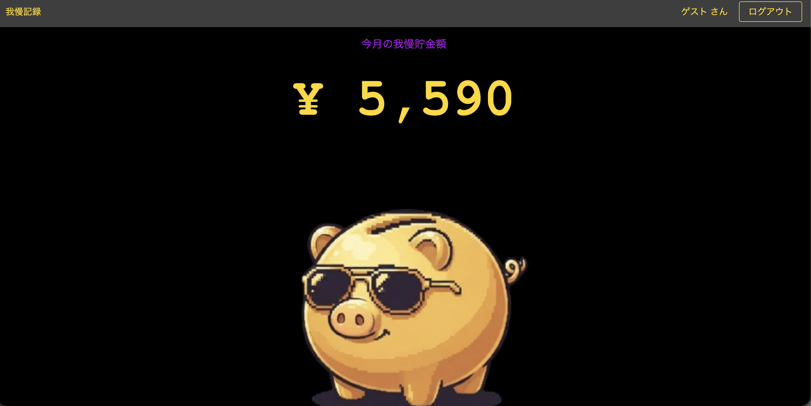
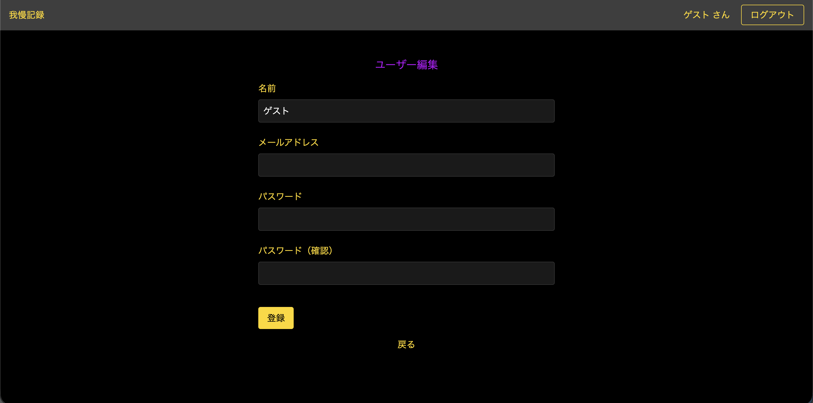

# 我慢貯金箱

## 公開　URL 
https://gaman-chokin.onrender.com


## スクリーンショット

### トップページ


### 我慢記録一覧ページ


### 登録ページ



## アプリを作った理由
日々の小さな誘惑に負けて、ついつい無駄遣いをしてしまうことがありませんか？
「ちょっとだけ」と思って買ったものが積み重なって、気づけば大きな出費に...。

このアプリは、 **「我慢した金額を記録して、貯金のモチベーションを高める」** ことを目的としています。
「買わなかった」という行動を可視化することで、我慢した達成感を味わいながら、楽しく貯金ができるアプリを目指しました。


## できること（機能一覧）

- **ユーザー登録・ログイン機能**
  - メールアドレスとパスワードで登録・ログイン
- **我慢記録の作成・編集・削除**
  - 我慢した内容と金額と日付を記録
  - 記録の編集・削除が可能
- **我慢貯金の合計金額表示**
  - 我慢した金額の合計を表示
- **我慢記録の一覧表示**
  - 日付順に我慢記録を一覧表示
  - 各記録の詳細を確認可能
- **プロフィール編集**
  - ユーザー情報の編集


## 技術スタック

### バックエンド
- Ruby 3.2.3
- Rails 7.1.2

### フロントエンド
- HTML / CSS
- Tailwind

### データベース
- PostgreSQL 16

### インフラ・デプロイ
- Docker / Docker Compose
- Render

### その他
- Git / GitHub


## 工夫したポイント
- **シンプルで直感的なUI**
  - 誰でも簡単に使えるように、シンプルで見やすいデザインを心がけました
- **貯金額の可視化**
  - 我慢した金額の合計を大きく表示し、達成感を味わえるようにしました


## 苦労したポイント

### 環境構築、デプロイ
初めてのアプリ作成でわからないことだらけでしたが、カリキュラムを参考に環境構築を行い、技術記事や動画、公式ドキュメントを参考にデプロイしました。

## 環境構築

### セットアップ手順

1. **リポジトリをクローン**
```\bash
git clone git@github.com:Kotiramisu/gaman_chokin.git
```

2. **コンテナのビルドと起動**
```
docker compose up --build
```

3. **データベースの作成**
```
docker compose exec web rails db:create
docker compose exec web rails db:migrate
```

4. **ブラウザでアクセス**
```
http://localhost:3000
```


## 今後の追加予定機能
- 音声・アニメーション
- ページネーション
- 年間の合計金額表示
- レスポンシブ対応
- 目標金額に対する達成率を表示
- グラフ機能の追加
- SNS シェア機能追加